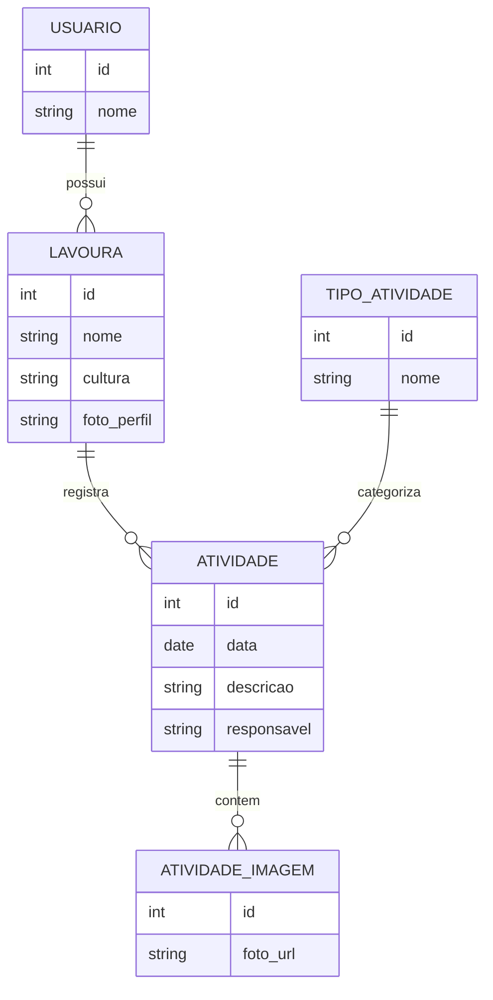
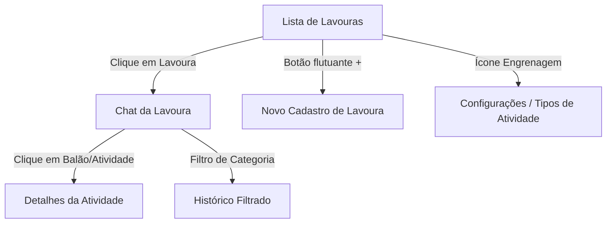

# 📱 AgroCafé: A "Bíblia" do Zap do Café

Este documento define a visão e o desenho do AgroCafé. Nossa inspiração máxima de usabilidade e interface é o **WhatsApp**. O objetivo é que qualquer pessoa que saiba usar o Zap, saiba gerenciar sua lavoura aqui.

---

## 💬 O Conceito: "Lavoura como Conversa"
Em vez de um sistema de gestão tradicional, o AgroCafé será uma lista de "conversas" onde cada conversa é uma **Lavoura de Café**.

### 📱 Tela Inicial (Lista de Chats)
- **Visual:** Foto de perfil da lavoura, nome da lavoura (ex: "Talhão 01 - Café" ou "Área Norte - Milho") e a última atividade realizada.
- **Botão de Ação (FAB):** Um botão flutuante no canto inferior direito para "Cadastrar Nova Lavoura" (igual ao botão de nova conversa do Zap).
- **Configurações:** Um ícone de engrenagem no topo para acessar a aba de **Configurações**, onde ficam os cadastros de Categorias, Tipos de Atividade e Perfil.

### 🖼️ Detalhes da Lavoura (O "Dados do Contato")
Ao clicar no nome ou na foto dentro da conversa, o sistema abre uma aba de detalhes (estilo Perfil do WhatsApp):
- **Visualizar:** Dados completos (área, tipo de cultura, data de início).
- **Editar:** Opção de modificar os dados da lavoura.
- **Mídia:** Uma galeria de todas as fotos já tiradas naquela lavoura, organizadas por data.

---

## 📝 A "Conversa" (Log de Atividades)
Ao clicar em uma lavoura, entramos na "conversa" daquela área.
- **Mensagens:** Cada atividade (adubação, colheita, banho) aparece como um balão de mensagem no histórico.
- **Detalhes:** Cada "bolha" contém a descrição, data, quem fez e fotos.
- **Filtro Inteligente:** Ao clicar em uma categoria (ex: clicar no selo "Adubação"), o sistema filtra o histórico para mostrar apenas as vezes que aquela atividade foi feita.
- **Ações Rápidas:** Botões de "Anexar" (+) e "Enviar" (seta) idênticos aos do Zap para registrar novas atividades.

---

## 🛠️ Escolha da Tecnologia (O Coração do App)
Para chegar no nível de fluidez do WhatsApp, temos dois caminhos:

1. **Flask + Jinja2 + HTMX (Simples):** Mais fácil de hospedar gratuitamente, mas requer mais esforço para parecer um "App real".
2. **React + Vite + Flask API (Premium):** 
    - **Vantagem:** Sensação de "App nativo", transições suaves entre telas, melhor para gerenciar as "bolhas de conversa" e filtros.
    - **Deploy:** Pode ser hospedado no **Vercel** (Frontend) + **PythonAnywhere** (Backend), ambos gratuitos.
    - **PWA:** Permite instalar o site no celular como se fosse um app (ícone na tela inicial).

> [!TIP]
> **Recomendação:** Para o "Zap do Café", o **React** entregará a experiência que você deseja. Vamos focar na escalabilidade da API para sustentar esse frontend moderno.

## 🏗️ Simplificação da Arquitetura (O Novo Banco)
Não precisamos de dezenas de tabelas. Vamos focar no essencial para ser leve e escalável:

1. **Usuário:** Dono da conta.
2. **Lavoura (O Chat):**
    - Nome, **Cultura (Café, Milho, Soja, etc.)**, Foto de Perfil, ID_Usuario.
3. **Tipo de Atividade (A Categoria):**
    - Nome (ex: Adubação, Colheita, Pulverização), Ícone, Cor.
4. **Atividade (A Mensagem):**
    - ID_Lavoura, ID_TipoAtividade, Data, Descrição, Responsável, Valor/Produção.
5. **Mídia da Atividade (Anexos):**
    - ID_Atividade, Foto_URL (Suporte a **múltiplos arquivos** por atividade).

### Visualização do Banco de Dados (ERD)

---

## 🖐️ IHC: Padrões de Uso do WhatsApp
- **Navegação:** Sem menus complexos. O fluxo é: Lista -> Conversa -> Detalhes.
- **Familiaridade:** Uso de cores e ícones que remetem ao ecossistema mobile que o produtor já domina.
- **Ações Rápidas:** Deslizar (swipe) na lavoura para ver ações rápidas (editar, arquivar).

### Fluxo de Navegação do "Zap"

---

## ☁️ Estratégia de Deploy e Mídia
- **Fotos:** Foco total no upload de imagens direto da câmera (campo -> app).
- **SQLite:** Perfeito para este modelo de dados simplificado e focado em mensagens.

---

> [!IMPORTANT]
> **Regra de Ouro:** Se uma funcionalidade nova for complexa demais para caber no modelo do WhatsApp, ela deve ser simplificada. A curva de aprendizado deve ser próxima de zero.
